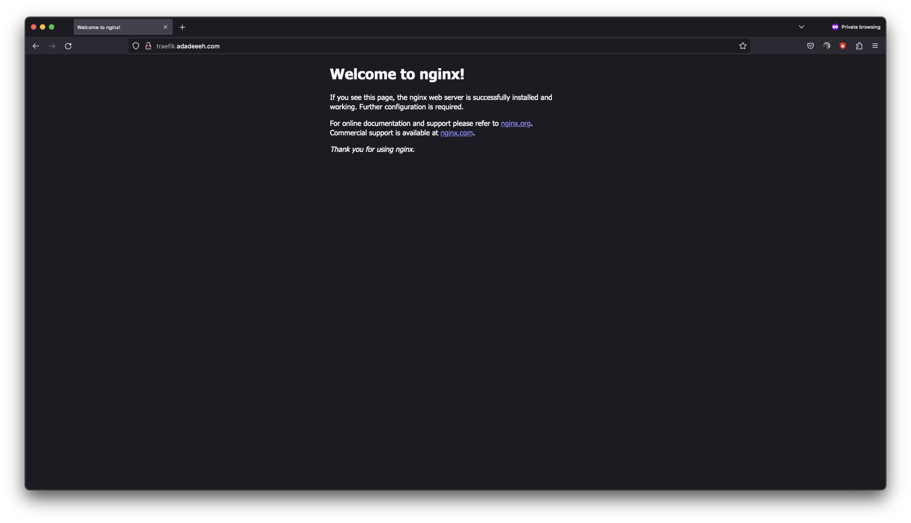
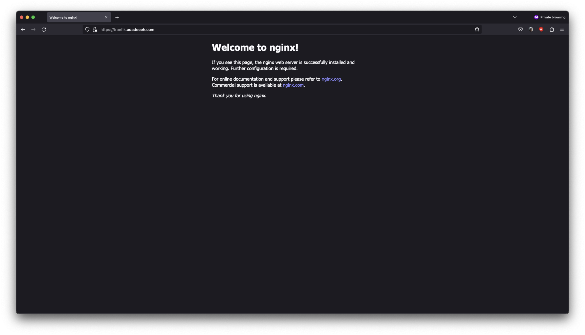

# traefik-certmanager

## Set Up

1. Create Kubernetes cluster

   ```
   eksctl create cluster -f eks-cluster.yaml
   ```

2. Install Traefik

   ```
   helm install traefik traefik/traefik --version 23.1.
   ```

3. Create DNS `CNAME` record point to Traefik external IP. In Cloudflare disabled proxy.

4. Install cert-manager

   ```
   helm install cert-manager jetstack/cert-manager --version v1.12.2 --set installCRDs=true
   ```

5. For production

   - Create `Issuer`

     ```
     kubectl apply -f cert-manager/issuer/issuer-prod.yaml
     ```

   - Create `Certificate`

     ```
     kubectl apply -f cert-manager/cert/certificate-prod.yaml
     ```

   - Create Traefik `Middleware` to redirect HTTP to HTTPS

     ```
     kubectl apply -f traefik/middleware/https.yaml
     ```

   - Create Traefik HTTP `Ingressroute`

     ```
     kubectl apply -f traefik/ingressroute/ingressroute-with-middleware.yaml
     ```

   - Create Traefik HTTPS `IngressRoute`

     ```
     kubectl apply -f traefik/ingressroute/ingressroute-secure-prod.yaml
     ```

##

1. HTTP without redirect to HTTPS
   
2. HTTPS staging
   
3. HTTPS production
   

## Clean Up

1. Uninstall cert-manager

   ```
   helm uninstall cert-manager
   ```

2. Uninstall Traefik

   ```
   helm uninstall traefik
   ```

3. Delete Kubernetes cluster

   ```
   eksctl delete cluster -f eks-cluster.yaml
   ```

## References

1. https://traefik.io/blog/secure-web-applications-with-traefik-proxy-cert-manager-and-lets-encrypt/
2. https://doc.traefik.io/traefik/getting-started/install-traefik/#use-the-helm-chart
3. https://github.com/traefik/traefik-helm-chart/tree/master
4. https://cert-manager.io/docs/installation/helm/
5. https://cert-manager.io/docs/configuration/acme/http01/
6. https://docs.technotim.live/posts/kube-traefik-cert-manager-le/
7. https://medium.com/@alexgued3s/how-to-easily-ish-471307f276a9
